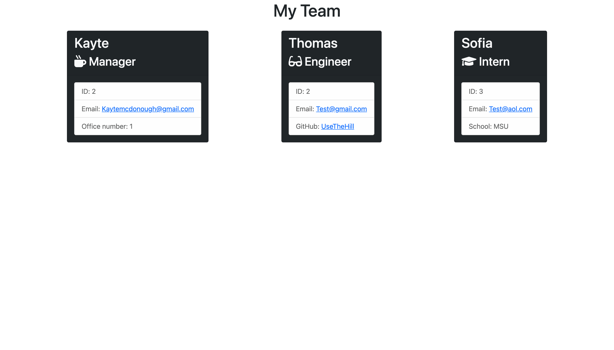

# team_profile_generator


## Description
Create an HTML webpage of your employees/team members from your command line!  Using inquirer, answer a few questions about each team member that will be used to display the content on the HTML output.  

## Technologies
* HTML
* CSS
* Bootstrap
* JavaScript
* Node.js
* Inquirer.js
* Jest

## Installation
To install the necessary dependencies to run this application on your local machine:

``` bash
npm --i
```
## Usage
Here's a quick look at what this app can do:  


Here's example content of what this app can generate:  




## License
Copyright &copy; Licensed under the MIT license.

## Questions
Contact me at kaytemcdonough@gmail.com with questions.